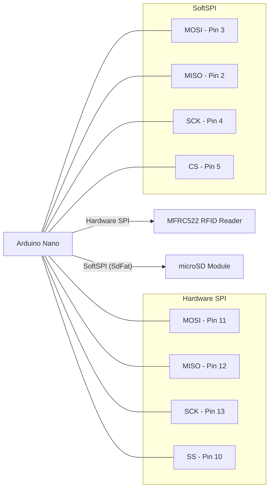

```mermaid
flowchart LR

Arduino[Arduino Nano]

RC522[MFRC522 RFID Reader]
SD[microSD Module]

Arduino -- Hardware SPI --> RC522
Arduino -- SoftSPI (SdFat) --> SD

subgraph Hardware SPI
MOSI1[MOSI - Pin 11]
MISO1[MISO - Pin 12]
SCK1[SCK - Pin 13]
SS1[SS - Pin 10]
end

subgraph SoftSPI
MOSI2[MOSI - Pin 3]
MISO2[MISO - Pin 2]
SCK2[SCK - Pin 4]
CS2[CS - Pin 5]
end

Arduino --- MOSI1
Arduino --- MISO1
Arduino --- SCK1
Arduino --- SS1

Arduino --- MOSI2
Arduino --- MISO2
Arduino --- SCK2
Arduino --- CS2
```
