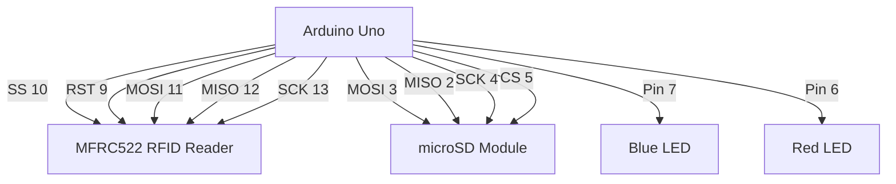

# Wiring Diagram

```mermaid
graph TD

Arduino[Arduino Uno]

RC522[MFRC522 RFID Reader]
SD[microSD Module]

LED1[Blue LED]
LED2[Red LED]

Arduino -->|SS 10| RC522
Arduino -->|RST 9| RC522
Arduino -->|MOSI 11| RC522
Arduino -->|MISO 12| RC522
Arduino -->|SCK 13| RC522

Arduino -->|MOSI 3| SD
Arduino -->|MISO 2| SD
Arduino -->|SCK 4| SD
Arduino -->|CS 5| SD

Arduino -->|Pin 7| LED1
Arduino -->|Pin 6| LED2
```
